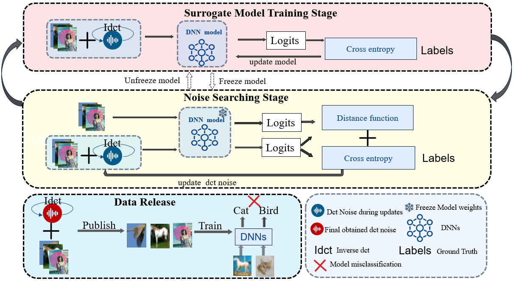

# Perturb In Frequency To Make Unlearnable Examples

This repository contains the PyTorch implementation of our paper titled "[**Perturb On Frequency To Make Unlearnable Examples**]".

## Overview
Overview of the Creating Unlearnable Examples by dct/dct2 Method. The modules in the above and middle illustrate the process
of iteratively updating model weights and searching DCT/DCT2 noise. The module at the bottom describes that, DNNs trained on data
released using our method exhibit misclassification.


## Usage

Check scripts folder for *.sh for each corresponding experiments. 
## Sample-wise dct/dct2 noise for unlearnable example on CIFAR-10
##### Generate dct noise for unlearnable examples
```console
python3 perturbation.py --config_path             configs/cifar10                \
                        --exp_name                path/to/your/experiment/folder \
                        --version                 resnet18                       \
                        --train_data_type         CIFAR10                        \
                        --noise_shape             50000 3 32 32                  \
                        --epsilon                 0.0313725490196                \
                        --channel                 20                             \
                        --num_steps               20                             \
                        --step_size               0.0313725490196                \
                        --attack_type             dct                            \
                        --perturb_type            samplewise                     \
                        --universal_train_target  'train_target'                 \
                        --universal_stop_error    0.01                           \
```
##### Generate dct2 noise for unlearnable examples
```console
python3 perturbation.py --config_path             configs/cifar10                \
                        --exp_name                path/to/your/experiment/folder \
                        --version                 resnet18                       \
                        --train_data_type         CIFAR10                        \
                        --noise_shape             50000 3 32 32                  \
                        --epsilon                 0.0313725490196                \
                        --channel                 20                             \
                        --num_steps               20                             \
                        --step_size               0.0313725490196                \
                        --attack_type             dct2                           \
                        --perturb_type            samplewise                     \
                        --universal_train_target  'train_target'                 \
                        --universal_stop_error    0.01                           \
```
You can acquire classwise noise  by ajusting ```--perturb_type``` parameter.


## Train the reference model using poisoned data

##### Train on unlearnable examples created by dct/dct2 method and eval on clean test
```console
python3 -u main.py    --version                 resnet18                       \
                      --exp_name                path/to/your/experiment/folder \
                      --config_path             configs/cifar10                \
                      --train_data_type         PoisonCIFAR10                  \
                      --poison_rate             1.0                            \
                      --perturb_type            samplewise                      \
                      --perturb_tensor_filepath path/to/your/experiment/folder/perturbation.pt \
                      --train
```
##### Train on clean data and eval on clean test
```console
python3 -u main.py    --version                 resnet18                       \
                      --exp_name                path/to/your/experiment/folder \
                      --config_path             configs/cifar10                \
                      --train_data_type         CIFAR10                  \
                      --poison_rate             1.0                            \
                      --perturb_type            samplewise                      \
                      --perturb_tensor_filepath path/to/your/experiment/folder/perturbation.pt \
                      --train
```
## Acknowledgement

We would like to acknowledge the work of [Huang et al.](https://github.com/HanxunH/Unlearnable-Examples) for their excellent framework for generating Error Minimization Unlearnable Examples. We have implemented our method based on the code they provided.
